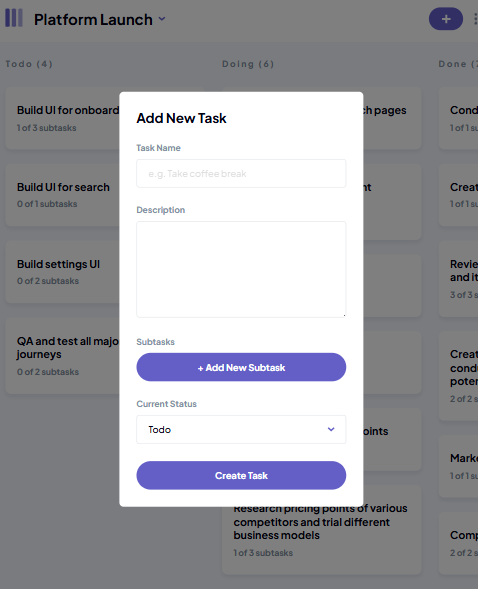

### Project Overview:
In this project, you'll build a **Kanban Task Management Web App**. The goal is to create a fully functional, interactive Kanban board that allows users to manage their tasks across different projects and categories. You'll focus on implementing essential task management features, such as creating, and deleting tasks, and providing a responsive UI that works well across devices.

---

### Project Requirements:

#### 1. **User Stories**:
- **Add New Board:** Users can create a new board (Platform Launch) with multiple columns representing stages of the task workflow (e.g., "To Do", "In Progress", "Completed").

    
- **Add Tasks:** Users can create tasks within a specific column, giving them titles, descriptions, status, and due dates.

    *Skip implementting Subtasks feature*

    

- **Delete Tasks:** Tasks can be removed or deleted.
- **Save Task Changes Locally:** The app should store task updates locally (using `localStorage` or a similar technique).
- **View Task Details:** Clicking on a task should open a modal displaying the task’s full details.

    *Skip displaying Subtasks feature and display the date instead*

    

#### 2. **Responsive Design**:
- Ensure the app is fully responsive and works well on various screen sizes, from mobile phones to desktops.
- Use a mobile-first approach, designing for smaller screens before scaling up to larger ones.

    - **Tablet Design**

        
        
        

    ---

    - **Mobile Design**

        
        
        
  
#### 3. **UI/UX Design**:
- Follow the provided design guidelines, focusing on clear navigation and intuitive task management.
- Implement hover effects, smooth transitions, and active states for an engaging user experience.
  
#### 4. **Task Interaction**:
- Tasks should be opened when user click on it.
- Create three dots at the top of the card when click on it it's remove the task.
---

### Technology Stack:
- **HTML/CSS**: Structure and style the app’s UI. You can use CSS frameworks (e.g., Tailwind, Bootstrap) or write custom CSS.
- **JavaScript**: Add interactivity, including task creation, editing, and drag-and-drop functionality.
- **LocalStorage**: Store the user's task data locally to persist across sessions.
---

### Bonus Features:
- **Dark Mode:** Allow users to toggle between light and dark themes.

### Material
- [Assets and icons ](https://drive.google.com/file/d/1g6C8rlQ_tQ2Ms0KWDSPq_h9y-ok2vsPk/view?usp=sharing) 